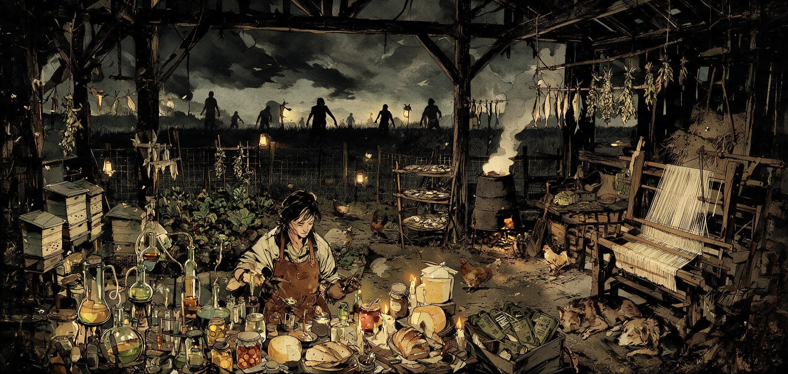

# Hydrocraft Reinvented [B42]

Порт классического мега-мода **Hydrocraft** (B41) на Project Zomboid **Build 42.20+**.
Оригинал: [Hydromancerx](https://github.com/Hydrocraft/Hydrocraft); поддержка B41: Hydrocraft Continued team. Порт на B42: **hombrehumor**.

[Мастерская Steam](https://steamcommunity.com/sharedfiles/filedetails/?id=3778201332) · [Сборка ZZZ Industrial Collection](https://steamcommunity.com/sharedfiles/filedetails/?id=3778214259) · [История версий](CHANGELOG.md) · [Дорожная карта](ROADMAP.md)

*English version below. Links: [Steam Workshop](https://steamcommunity.com/sharedfiles/filedetails/?id=3778201332) · [Changelog](CHANGELOG.md) · [Roadmap](ROADMAP.md)*

---

## Русский

### Философия порта: «дополнить, не задублировать»

Build 42 сам добавил многое из того, что Hydrocraft делал в B41. Эти подсистемы
не переносились — их роль теперь играет ваниль:

| Система Hydrocraft B41 | Замена в B42 |
|---|---|
| Кузнечное дело, металлургия | навыки Blacksmith / Melting |
| Гончарство | навык Pottery |
| Камнеобработка, кладка | навыки Masonry / Carving |
| Стекло | навык Glassmaking |
| Костяные изделия | навык Carving |
| Разделка туш | навык Butchering |
| Скот-как-предметы | живые животные (Husbandry) |
| Переплавка металлолома | ванильный Melting |
| Розжиг, компост | ванильные механики |

Общие материалы из вырезанных систем (клеи, ленты, банки — 120 предметов),
на которые ссылается остальной контент, сохранены.

### Что внутри

- **5 196 предметов** — животные и собаки, MRE-пайки, электроника, шахты,
  пасека, ткачество, химия, сотни блюд и напитков
- **3 620 рецептов** (2 086 уникальных, 99 % переносимого объёма B41) — полная
  конвертация в систему `craftRecipe` B42
- **121 схема починки**, 233 модели, 5 679 текстур, 38 звуков, tiledef 591
- **Полная русская локализация**: 100 % предметов, 100 % рецептов,
  все 32 категории крафта; базовые переводы ещё на 9 языков (48 000+ ключей)

### Как это сделано (API B42)

- `recipe` → `craftRecipe` по грамматике ванильных рецептов B42:
  `inputs`/`outputs`, `mode:keep/destroy`, теги инструментов (`base:hammer`,
  `base:saw`…), жидкости через `-fluid`, `SkillRequired`, `xpAward`
- 282 OnCreate-функции работают через мост-обёртку
  B41 `fn(items, result, player)` ← B42 `fn(craftRecipeData, character)`
- Слоты одежды переведены на неймспейс B42 (`base:hat`, `base:jacket`…)
- Распределения лута портированы с защитой от изменившихся таблиц B42
- 33 переименования ванильных предметов B41→B42 учтены автоматически
  (Flour→Flour2, WaterPot→Pot, WhiskeyEmpty→Whiskey…)

### Совместимость

Создан для локальной сборки ZZZ (70+ модов): проверены коллизии модулей,
звуков, tiledef и категорий. Дружит с Sapph's Cooking, Industrial Revolution,
Factory Pieces. Порядок загрузки не важен, зависимостей нет.

### Установка

Скопировать папку `HydrocraftReinvented` в `C:\Users\<user>\Zomboid\mods\`
и включить мод в игре. Требуется Build 42.20 или новее.

### Известные ограничения

- Экзотические культуры HC пока предметы/лут, а не грядки B42
  (интеграция с фермерством — следующий этап).
- Книги, обучавшие рецептам вырезанных систем, ничему не учат.
- Механика «очки/слуховой аппарат лечат черты» отключена: в B42 нет
  TraitFactory (черты стали скриптами).

---

## English

### Port philosophy: complement, don't duplicate

Build 42 natively added much of what Hydrocraft did in B41. Those subsystems
were intentionally **not** ported — vanilla covers them now:

| Hydrocraft B41 system | B42 replacement |
|---|---|
| Smithing, metallurgy | Blacksmith / Melting skills |
| Pottery | Pottery skill |
| Stoneworking, masonry | Masonry / Carving skills |
| Glassworking | Glassmaking skill |
| Boneworking | Carving skill |
| Butchering | Butchering skill |
| Livestock-as-items | live animals (Husbandry) |
| Scrap melting | vanilla Melting |
| Firecrafting, composting | vanilla mechanics |

Shared materials from the cut systems (glues, tapes, jars — 120 items)
referenced by the rest of the content were rescued.

### What's inside

- **5,196 items** — animals and dogs, MRE rations, electronics, mines,
  beekeeping, weaving, chemistry, hundreds of dishes and drinks
- **3,620 recipes** (2,086 unique, 99% of portable B41 content) — fully
  converted to the B42 `craftRecipe` system
- **121 fixing schemes**, 233 models, 5,679 textures, 38 sounds, tiledef 591
- **Full Russian localization**: 100% of items, 100% of recipes, all 32 craft
  categories; base translations for 9 more languages (48,000+ keys)

### How it was done (B42 API)

- `recipe` → `craftRecipe` following vanilla B42 grammar: `inputs`/`outputs`,
  `mode:keep/destroy`, tool tags (`base:hammer`, `base:saw`…), fluids via
  `-fluid`, `SkillRequired`, `xpAward`
- 282 OnCreate functions run through a bridge wrapper:
  B41 `fn(items, result, player)` ← B42 `fn(craftRecipeData, character)`
- Clothing slots migrated to the B42 namespace (`base:hat`, `base:jacket`…)
- Loot distributions ported with guards against B42's restructured tables
- 33 vanilla B41→B42 item renames handled automatically
  (Flour→Flour2, WaterPot→Pot, WhiskeyEmpty→Whiskey…)

### Compatibility

Built for the local ZZZ pack (70+ mods): module, sound, tiledef and category
collisions verified. Coexists with Sapph's Cooking, Industrial Revolution,
Factory Pieces. Load order does not matter; no dependencies.

### Installation

Copy the `HydrocraftReinvented` folder into `C:\Users\<user>\Zomboid\mods\`
and enable the mod in game. Requires Build 42.20 or newer.

### Known limitations

- Exotic HC crops are items/loot for now, not B42 farm plants
  (farming integration is the next milestone).
- Books that taught recipes of the cut systems teach nothing.
- The "glasses / hearing aid cure traits" mechanic is disabled: B42 removed
  TraitFactory (traits are scripts now).

---

## Credits

- **Hydromancerx** — original Hydrocraft
- **Hydrocraft Continued team** — B41 maintenance
- **hombrehumor** — B42 port, Russian localization
