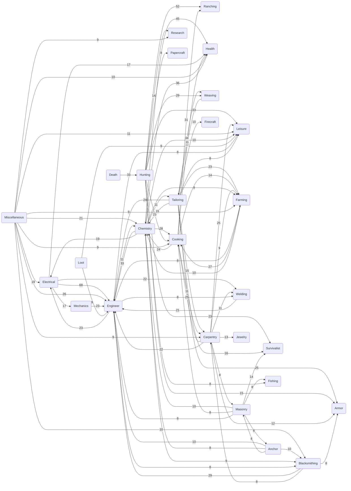

# Карта крафта и обучения / Craft & Learning Flowcharts

*Автогенерация из скриптов мода (v1.5.0): 5196 предметов, 3587 рецептов,
148 книг и чертежей. Полные данные — в [HCR_Database.xlsx](HCR_Database.xlsx).*

*Auto-generated from the mod scripts (v1.5.0). Full data in [HCR_Database.xlsx](HCR_Database.xlsx).*

## 1. Обучение: откуда берутся рецепты / Learning map

Семейства обучающих предметов и категории рецептов, которым они учат
(на стрелках — число рецептов; связи реже 2 рецептов скрыты).

```mermaid
flowchart LR
    n0["📚 Кулинарные книги<br/>18 шт."]
    n1["📚 Планшеты и исследования<br/>7 шт."]
    n2["📚 Прочие источники<br/>7 шт."]
    n3["📚 Учебники<br/>82 шт."]
    n4["📚 Чертежи<br/>34 шт."]
    n5("Armor<br/>4 рец.")
    n6("Blacksmithing<br/>63 рец.")
    n7("Carpentry<br/>17 рец.")
    n8("Chemistry<br/>180 рец.")
    n9("Cooking<br/>350 рец.")
    n10("Death<br/>34 рец.")
    n11("Electrical<br/>132 рец.")
    n12("Engineer<br/>90 рец.")
    n13("Farming<br/>211 рец.")
    n14("Firecraft<br/>2 рец.")
    n15("Fishing<br/>14 рец.")
    n16("Health<br/>51 рец.")
    n17("Hunting<br/>117 рец.")
    n18("Jewelry<br/>22 рец.")
    n19("Leisure<br/>46 рец.")
    n20("Locksmithing<br/>7 рец.")
    n21("Masonry<br/>36 рец.")
    n22("Papercraft<br/>6 рец.")
    n23("Programing<br/>3 рец.")
    n24("Ranching<br/>15 рец.")
    n25("Research<br/>14 рец.")
    n26("Survivalist<br/>12 рец.")
    n27("Tailoring<br/>21 рец.")
    n28("Trapper<br/>8 рец.")
    n29("Weaving<br/>64 рец.")
    n30("Welding<br/>3 рец.")
    n0 -->|249| n9
    n3 -->|210| n13
    n3 -->|155| n8
    n3 -->|89| n17
    n3 -->|86| n12
    n3 -->|81| n11
    n3 -->|61| n6
    n3 -->|56| n9
    n3 -->|55| n29
    n3 -->|42| n19
    n1 -->|41| n9
    n3 -->|34| n21
    n3 -->|34| n10
    n3 -->|33| n16
    n4 -->|27| n11
    n1 -->|26| n17
    n4 -->|25| n8
    n2 -->|24| n11
    n3 -->|22| n18
    n3 -->|21| n27
    n4 -->|18| n16
    n3 -->|17| n7
    n3 -->|15| n24
    n3 -->|13| n25
    n3 -->|13| n15
    n3 -->|9| n26
    n3 -->|7| n20
    n3 -->|6| n22
    n4 -->|6| n29
    n3 -->|4| n28
    n3 -->|4| n5
    n4 -->|4| n28
    n4 -->|4| n19
    n2 -->|4| n9
    n3 -->|3| n23
    n1 -->|3| n29
    n3 -->|3| n30
    n4 -->|3| n12
    n3 -->|2| n14
    n0 -->|2| n17
    n1 -->|2| n26
    n4 -->|2| n21
    n2 -->|2| n6
```

## 2. Потоки крафта между категориями / Cross-category craft flows

Стрелка «A → B» означает: результаты рецептов категории A служат ингредиентами
рецептов категории B (на стрелке — число таких рецептов; связи реже 8 скрыты).

## 3. Самые глубокие производственные цепочки / Deepest craft chains

Показательные цепочки предметов (подписи на стрелках — рецепты).

### Цепочка 1 (14 звеньев)

### Цепочка 2 (14 звеньев)

### Цепочка 3 (14 звеньев)

### Цепочка 4 (14 звеньев)

### Цепочка 5 (14 звеньев)

### Цепочка 6 (14 звеньев)

